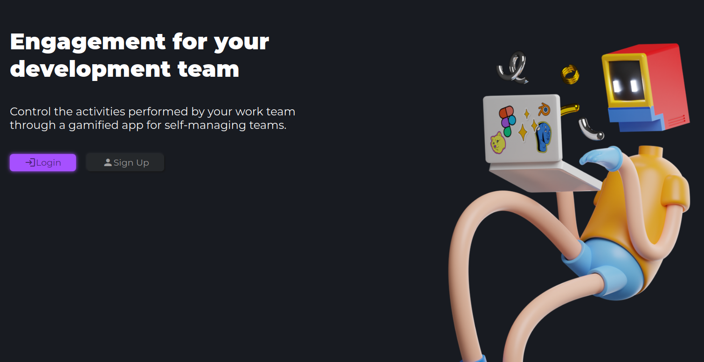
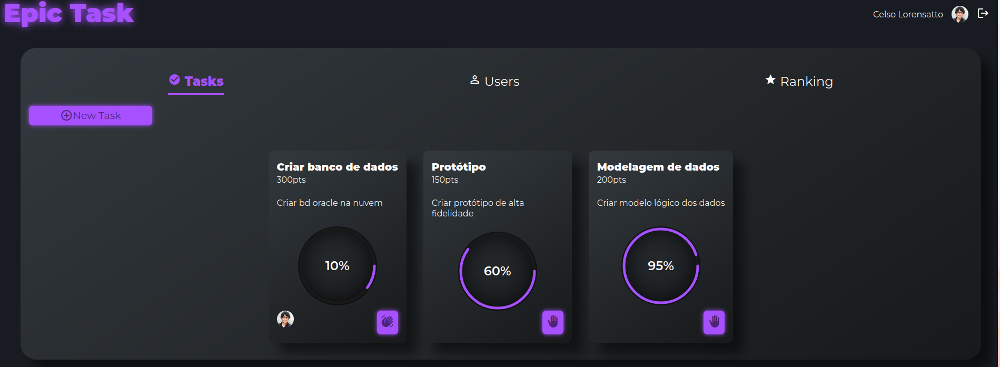
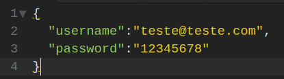
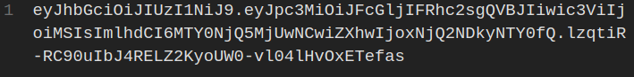
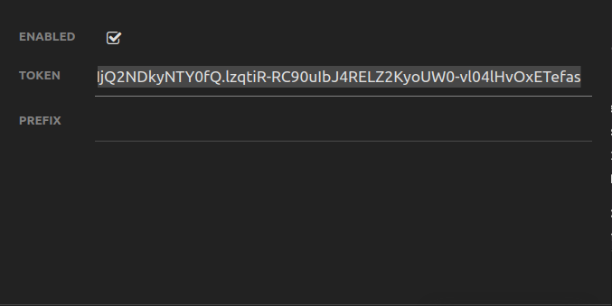

## Sobre

Acesse o projeto [aqui](https://epictask.herokuapp.com/).

Aplicação para gerenciamento de tarefas de um projeto, com intenção de distribuir pontos de participações de conclusões de tarefas para promover um ranqueamento daqueles com mais contribuições.

---

## Preview

---

## Tecnologias

1. Spring Boot
2. Thymeleaf
3. Thyemleaf-extras-springsecurity
4. lombok
5. jpa
6. Spring-Boot Validation
7. Spring-Boot Cache
8. openapi-ui
9. h2-database
10. jwt

---

## API

Api ultiliza um sistema de verificação de token por requisição gerado assim que o usuário é verificado no sistema, portanto será necessário fazer o processo de autenticação de usuário para assim, receber o token e com ele executar uma autenticação do tipo **Bearer** (que ultiliza o prefixo padrão).

- Primeiro mandamos um JSON com as chaves de "username" e "password" e preenchemos os respectivos valores com os dados validos.
  

- Depois de feito com sucesso a Autenticação de usuário, o sistema irá retornar uma chave:
  

- Para fazer o uso desta chave, preencha o espaço de token na autenticação de tipo Bearer:
  .

Agora você ira ultilizar esta chave para fazer a interação com as funções do sistema, como criar ou apagar uma tarefa, criar um usuário e etc...

Para mais informações sobre a documentação da API [clique aqui](https://epictask.herokuapp.com/swagger-ui/index.html#/).

---

## Progresso

- [x] Planejamento da proposta do projeto;
- [x] Padrão de Design;
- [x] Configuração dos EndPoint's;
- [x] Login/logout de usuário;
- [x] Ajustando configuração de segurança de autenticação e jornada de requisições;
- [x] Funcionalidades de tarefas funcionando;
- [ ] Administração de perfil de usuário;
- [ ] Usuário poderá criar seu próprio projeto.
- [ ] Funcionalidades de administração do proprietário do projeto;
- [ ] Sistema de relacionamento de projetos com usuários(convites, lista de espera);
- [ ] Sistema de hierarquia entre usuários em projetos.
- [ ] Adicionando sub-tarefas em tarefas e funcionalidades de administração;
- [ ] funcionalidades de notificações de sistema para usuários, projetos e administração;
- [ ] funcionalidade de interação entre usuário e administrador do projeto;
- [ ] Desvincular um banco de dados H2 do projeto;
